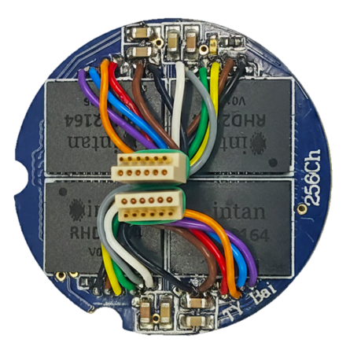
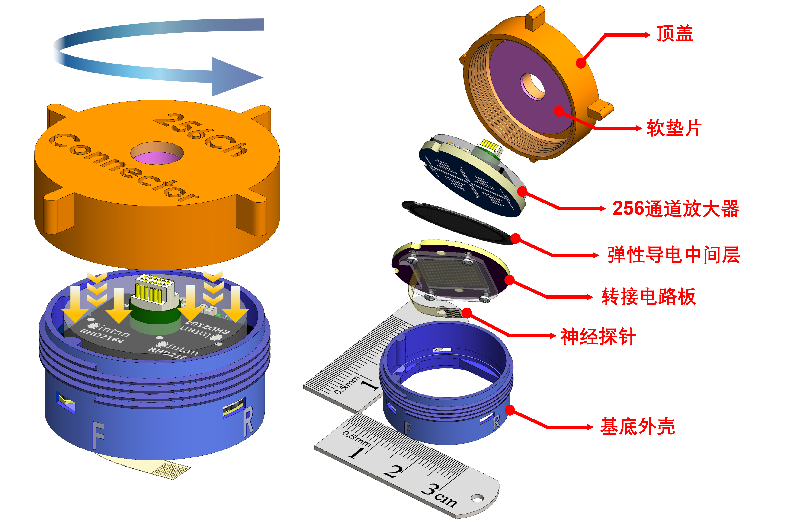

<link rel="preconnect" href="https://fonts.googleapis.com">
<link rel="preconnect" href="https://fonts.gstatic.com" crossorigin>

  

    <a href="https://tianyu-bai.github.io/E-Link">
      🌐 Click here to view the interactive website
    </a>
  

  
  
  
  
  
  

  <h1 class="header-sync-pulse">
    
      
    
  </h1>

<h2 class="sub-title" data-aos="fade-up" data-aos-delay="200">
  An Open-Source, Elastomer Interconnection-based   Connector for Flexible Neural Interfaces
</h2>

   
    
    
    
     
 

  

  
 
 

   <b>Mating Dynamics (left) and Structural Breakdown (right) of the E-Link(256) </b>
 

## 🔬 Interactive 3D Model: E-Link Headstage Integration
 

  <model-viewer
    class="custom-model-viewer"
    src="{{ '/Videos/On skull_3.16MB.glb' | relative_url }}"
    alt="E Link on Skull 3D Model"
    loading="eager"   reveal="manual"
    poster="{{ '/Images/poster.webp' | relative_url }}"
    camera-controls interpolation-decay="200" bounds="tight" field-of-view="30deg" auto-rotate  rotation-per-second="15deg"
    interaction-prompt="none" environment-image="neutral" exposure="0.75" shadow-intensity="0" tone-mapping="commerce">

      

      

      

      

      

      

      

        

        
INITIALIZING 3D SIGNAL...

        
[ SCROLL OR CLICK TO REVEAL ]

      

    

    

Copyright © 2026 Tianyu Bai

  ↺ Rotate: Drag
  Zoom: Ctrl + 🖱 Wheel/Trackpad Pinch
  Zoom: Pinch

  

    
👉

    
👈

  

  

    Ctrl + 🖱️Wheel to Zoom
    Pinch with two fingers to Zoom
  

      

👆

      
Drag to Rotate

    

    
    <button class="reset-btn"
  onclick="
    const mv = this.closest('model-viewer');
    mv.setAttribute('camera-orbit','45deg 55deg auto');
    mv.setAttribute('field-of-view','30deg');
  ">
      ⟲ Reset View
    </button>
  </model-viewer>

## 🔬 E-Link – 3D Interactive View
 

  <model-viewer
    class="custom-model-viewer"
    src="{{ '/Videos/Whole_2.34MB.glb' | relative_url }}"
    alt="E Link 3D Model"
    loading="lazy"       reveal="manual"
    poster="{{ '/Images/poster.webp' | relative_url }}"
    camera-controls interpolation-decay="200" bounds="tight" field-of-view="30deg" auto-rotate  rotation-per-second="15deg"
    interaction-prompt="none" environment-image="neutral" exposure="0.75" shadow-intensity="0" tone-mapping="commerce">

   

      

      

      

      

      

      

        

        
INITIALIZING 3D SIGNAL...

        
[ SCROLL OR CLICK TO REVEAL ]

      

    

    
    
Copyright © 2026 Tianyu Bai

    

  ↺ Rotate: Drag
  Zoom: Ctrl + 🖱 Wheel/Trackpad Pinch
  Zoom: Pinch

  

    
👉

    
👈

  

  

    Ctrl + 🖱️Wheel to Zoom
    Pinch with two fingers to Zoom
  

    

      

👆

      
Drag to Rotate

    

    
   <button class="reset-btn"
  onclick="
    const mv = this.closest('model-viewer');
    mv.setAttribute('camera-orbit','45deg 55deg auto');
    mv.setAttribute('field-of-view','30deg');
  ">
      ⟲ Reset View
    </button>
  </model-viewer>

## 🔬 256Ch Customized Headstage – 3D Interactive View

  <model-viewer
    class="custom-model-viewer"
    src="{{ '/Videos/3D_1.85MB.glb' | relative_url }}"
    alt="E-Link 256-Channel Custom Headstage 3D Model" 
    loading="lazy"       reveal="manual"
    poster="{{ '/Images/poster.webp' | relative_url }}"
    camera-controls interpolation-decay="200" bounds="tight" field-of-view="30deg" auto-rotate  rotation-per-second="15deg"
    interaction-prompt="none" environment-image="neutral" exposure="0.75" shadow-intensity="0" tone-mapping="commerce">

      

      

      

      

      

      

      

        

        
INITIALIZING 3D SIGNAL...

        
[ SCROLL OR CLICK TO REVEAL ]

      

    

    
    
Copyright © 2026 Tianyu Bai

    

  ↺ Rotate: Drag
  Zoom: Ctrl + 🖱 Wheel/Trackpad Pinch
  Zoom: Pinch

  

    
👉

    
👈

  

  

    Ctrl + 🖱️Wheel to Zoom
    Pinch with two fingers to Zoom
  

    

      

👆

      
Drag to Rotate

 

   <button class="reset-btn"
  onclick="
    const mv = this.closest('model-viewer');
    mv.setAttribute('camera-orbit','45deg 55deg auto');
    mv.setAttribute('field-of-view','30deg');
  ">
      ⟲ Reset View
    </button>
  </model-viewer>

 

  

    
WEIGHT

    

      <svg viewBox="0 0 100 100"><circle class="bg-ring" cx="50" cy="50" r="45"></circle><circle class="fg-ring weight-color" cx="50" cy="50" r="45"></circle></svg>
      

        

          0g
        

      

    

    
Lightweight

  

  

    
CHANNELS

    

      <svg viewBox="0 0 100 100"><circle class="bg-ring" cx="50" cy="50" r="45"></circle><circle class="fg-ring channel-color" cx="50" cy="50" r="45"></circle></svg>
      

        

          0
        

      

    

    
High-Density

  

  

    
PCB LAYERS

    

      <svg viewBox="0 0 100 100"><circle class="bg-ring" cx="50" cy="50" r="45"></circle><circle class="fg-ring pcb-color" cx="50" cy="50" r="45"></circle></svg>
      

        

          0
        

      

    

    
Custom Routing

  

  
  

    
TEMPERATURE

    

      

        

        

        
37°C

      

      

    

    
0
°C
    
Below Bio Threshold

  

  

    
NOISE FLOOR

    
<canvas class="waveform-canvas"></canvas>

    
0
µV (RMS)
    
Near Chip Limit

  

  

    
STRESS TESTED

    

      

        🫸
        
          <svg width="1em" height="1em" viewBox="0 0 24 24" fill="none" stroke="currentColor" stroke-width="2.5" stroke-linecap="round" stroke-linejoin="round">
            <path d="M12 3v14"></path>
            <path d="m7 12 5 5 5-5"></path>
            <path d="M4 21h16"></path>
          </svg>
        
      

      

      
+1

    

    
0
+
    
97%+ Yield Maintained

  

## 📖 Overview

**E-Link** (Elastomer Interconnection-based connector) is an open-source, miniature pedestal connector system based on elastomer interconnection. It provides a robust, scalable interface for High-Density Soft Neural Interfaces, specifically engineered for chronic applications in freely moving animals.

  
 

   
 

---

> [!NOTE]
> **Key Innovation:** The system integrates two high-density PCBs, an anisotropic elastomeric contact interface, and a lightweight pedestal housing into a fully integrated, headstage-ready solution.

---

### 📊 Quick Specifications

  <table style="margin-left: auto; margin-right: auto; width: 90%; min-width: 600px; text-align: center; border-collapse: collapse; border: 1px solid #e1e4e8;">
   <thead>
     <tr style="background-color: #f6f8fa; border-bottom: 2px solid #e1e4e8;">
       <th style="padding: 10px; border: 1px solid #e1e4e8;">Specification</th>
       <th style="padding: 10px; border: 1px solid #e1e4e8;">E-Link(256)_V1.0</th>
     </tr>
   </thead>
   <tbody>
     <tr>
       <td style="padding: 8px; border: 1px solid #e1e4e8;"><b>Channel Count</b></td>
       <td style="padding: 8px; border: 1px solid #e1e4e8;">128 or 256 Channels (Single/Dual SPI Port support)</td>
     </tr>
     <tr>
       <td style="padding: 8px; border: 1px solid #e1e4e8;"><b>Total Mass</b></td>
       <td style="padding: 8px; border: 1px solid #e1e4e8;">6.6 g (with housing) 2.8 g (without housing)</td>
     </tr>
     <tr>
       <td style="padding: 8px; border: 1px solid #e1e4e8;"><b>Interconnect Type</b></td>
       <td style="padding: 8px; border: 1px solid #e1e4e8;">Solderless Anisotropic Elastomer</td>
     </tr>
     <tr>
       <td style="padding: 8px; border: 1px solid #e1e4e8;"><b>Compatible Acquisition System</b></td>
       <td style="padding: 8px; border: 1px solid #e1e4e8;">Intan Recording Controller (512ch/1024ch) Open-Ephys DAQ box NeuroNexus Smartbox OmniPlex DAQ box</td>
     </tr>
     <tr>
       <td style="padding: 8px; border: 1px solid #e1e4e8;"><b>Housing Material</b></td>
       <td style="padding: 8px; border: 1px solid #e1e4e8;">3D-Printed PEEK / Surgical Grade Resin</td>
     </tr>
   </tbody>
 </table>

 

  

    <h3 class="pipeline-card-title">⚙️ Assembly & Validation Pipeline</h3>
    

      The insertion-free <strong style="color: #e2e8f0;">"rotate-and-play"</strong> interface eliminates micro-alignment requirements, enabling reproducible assembly by untrained operators with consistent electrical performance.
    

 
    <!-- Pipeline Steps -->
    

      <!-- Track line with flowing light -->
      

        

      

 
      

        
01

        

          🔩
          Seat Pedestal
        

      

 
      

        
02

        

          📐
          Place Adapter PCB
        

      

 
      

        
03

        

          🧬
          Put Elastomer
        

      

 
      

        
04

        

          🔌
          Seat Headstage
        

      

 
      

        
05

        

          🔄
          Rotate Threaded Cap
        

      

 
      

        
06

        

          ✅
          Electrical Verify
        

      

    

 
    <!-- Validation Stats -->
    

      

        
Independent Operators Verified

        
Consistent connection yield across all users — decoupled from individual technique.

      

      

        
200+ Mating Cycles

        
Zero degradation in contact impedance or yield over 5-day longitudinal durability test.

      

      

        
180 min Vibration

        
Yield maintained under ~23 m/s² extreme acceleration stress testing.

      

    

  

## 🧩 System Components

<h3>🔬 Interactive Cross-Section Explorer</h3>

Click any component below or hover directly on the cross-section to highlight the corresponding layer and view specifications.

1
2
3
4
5
6
1. SPI Cables
2. Foam Washer
3. Threaded Cap
4. Headstage PCB
5. Elastomer
6. Adapter PCB

1

SPI Cables

Dual Omnetics A7621

2

Foam Washer

Pressure distribution

3

Threaded Cap

Compression housing

4

Headstage PCB

4× RHD2164 + 4Layer HDI

5

Elastomeric Sheet

Z-axis conductor

6

Adapter PCB

Probe signal routing

 <table border="1" style="border-collapse: collapse; width: 90%; text-align: center;">
  <thead>
    <tr style="background-color: #f2f2f2;">
      <th>Component</th>
      <th>Description</th>
    </tr>
  </thead>
  <tbody>
    <tr>
      <td><b>Pedestal Housing</b></td>
      <td>3D-printed/machined pedestal providing structural support and cranial fixation</td>
    </tr>
    <tr>
      <td><b>Customized 256Ch Headstage</b></td>
      <td>Form-factor optimized recording interface for high-density 128/256-channel signal acquisition</td>
    </tr>
    <tr>
      <td><b>Foam Washer</b></td>
      <td>Provides compliant compression to ensure uniform electrical contact across the elastomeric interface</td>
    </tr>
    <tr>
      <td><b>Adapter PCB</b></td>
      <td>High-density 4-layer PCB for routing signals from thin-film probes to headstage ball array pattern</td>
    </tr>
    <tr>
      <td><b>Surgical Cap</b></td>
      <td>Protective enclosure preserving electrical and mechanical integrity throughout chronic experiments</td>
    </tr>
  </tbody>
 </table>

 
---
 

 

  

    <h3 class="impedance-card-title">🔬 16×16 Spatial Impedance Mapping</h3>
    

      Gold-film test interface validates uniform contact pressure distribution. The threaded housing converts manual torque into uniform axial pressure across the entire 25-mm footprint.
    

 
    

      <!-- LEFT: Heatmap -->
      

        

          Row Index
          

            <canvas id="impedance-canvas" width="256" height="256"></canvas>
          

          
Column Index

        

        

          0.3 kΩ
          

          2.0 kΩ
        

      

 
      <!-- RIGHT: Findings -->
      

        

          
Results

          

            253 / 256
            channels within 0.3 – 0.4 kΩ
          

          

            3 channels
            > 1.0 kΩ (BGA reflow defects)
          

          

            0 failures
            from connector interface itself
          

        

 
        

          

            <strong style="color: #34d399;">Conclusion:</strong> The mechanical connector interface achieves 
            <strong style="color: #ffffff;">100% connection fidelity</strong>.
          

        

      

    

  

 

## ✨ Key Features

  <h3 style="color: #60a5fa; margin-bottom: 20px; font-family: sans-serif;">🌍 Future Application Roadmap </h3>
  
  

  <svg class="connection-lines" viewBox="0 0 600 380" preserveAspectRatio="none" style="z-index: 1;">
    <path class="base-line" d="M300,141 L100,225" stroke="rgba(255,255,255,0.1)" fill="none" /> 
    <path class="base-line" d="M300,141 L300,255" stroke="rgba(255,255,255,0.1)" fill="none" /> 
    <path class="base-line" d="M300,141 L500,225" stroke="rgba(255,255,255,0.1)" fill="none" /> 
    
    <path class="pulse-line line-to-mouse" d="M300,141 L100,225" />
    <path class="pulse-line line-to-rat" d="M300,141 L300,255" />
    <path class="pulse-line line-to-monkey" d="M300,141 L500,225" />
  </svg>

 

      

        <svg width="40" height="40" viewBox="0 0 24 24" fill="none" xmlns="http://www.w3.org/2000/svg">
          <path d="M7 2V4M12 2V4M17 2V4M22 7H20M22 12H20M22 17H20M17 22V20M12 22V20M7 22V20M2 17H4M2 12H4M2 7H4M6 6H18V18H6V6ZM9 9V15H15V9H9Z" stroke="#60a5fa" stroke-width="2" stroke-linecap="round" stroke-linejoin="round"/>
        </svg>
      

      
E-Link (256)

    

 

      
  

        

          🐁
        

        
<i>Mouse</i>

        
Housing Removed <b>2.8g Payload</b>

      

  

        

          🐀
        

        
<i>Rat</i>

        
Standard Implant <b>6.6g Total</b>

      

  

        

          🐒
        

        
<i>Macaque</i>

        
High Durability <b>Multi-Array Scalable</b>

      

    

  

 

  

    <h3 class="scale-card-title">🚀 Scalability Roadmap: Pathway to 1024 Channels</h3>
    

      The inherent pitch advantage of anisotropic elastomeric technology enables massive channel scaling within the <strong style="color: #e2e8f0;">same 25-mm diameter footprint</strong>, without modifications to the mechanical compression housing.
    

 
    <!-- Bar Chart -->
    

      

        CURRENT
        

          256
        

      

      

        NEXT PHASE
        

          512
        

      

      

        TARGET
        

          1024+
        

      

    

 
    

 
    <!-- Pitch Comparison -->
    

      

        156 µm
        Elastomeric Pillar Pitch
        3.2× DENSER
      

      

        500 µm
        Standard Solder Ball Pitch
        INDUSTRY BASELINE
      

    

 
    

      Same <strong style="color: #ffffff;">25 mm Ø</strong> footprint · HDI PCB fan-out · Fine-pitch elastomer pillar arrangement
    

  

 

 

  <ul>
    <li data-aos="fade-up" data-aos-delay="0">
      <strong>⚡ 256-Channel High-Density & Scalable Interface</strong> 
      Compact pedestal footprint supporting 256-ch acquisition. The elastomer-based design offers a clear scaling roadmap (up to 1024-ch) without increasing physical size.
    </li>
    <li data-aos="fade-up" data-aos-delay="100">
      <strong>🔌 Zero-Force "Soft" Interconnect</strong> 
      By replacing rigid pins with Anisotropic Conductive Elastomer, the system shifts from "insertion" to "compression," eliminating common "bent pin" failure modes.
    </li>
    <li data-aos="fade-up" data-aos-delay="200">
      <strong>🎯 Self-Aligning & High Tolerance</strong> 
      Features high-precision mechanical guidance with "Structural Redundancy," naturally forgiving minor manual misalignments without microscopic assistance.
    </li>
    <li data-aos="fade-up" data-aos-delay="300">
      <strong>🛠️ Modular Maintenance & On-Demand Assembly</strong> 
      Separable "Sandwich" structure allows independent replacement of damaged modules and supports on-demand chip soldering to save research costs.
    </li>
    <li data-aos="fade-up" data-aos-delay="400">
      <strong>🪶 Detachable Active Electronics</strong> 
      Easily separate heavy electronics from the implanted pedestal during rest, leaving only a lightweight passive interface to promote natural animal behavior.
    </li>
    <li data-aos="fade-up" data-aos-delay="500">
      <strong>🐭 Optimized for Chronic In-Vivo Research</strong> 
      Lightweight core (2.8g) and low-profile design compatible with commutators, ensuring robust long-term recording in freely moving animals.
    </li>
    <li data-aos="fade-up" data-aos-delay="600">
      <strong>🧪 Surgical-Grade Integration</strong> 
      Textured sidewalls for superior adhesion and customizable base curvature to match specific cranial profiles, creating a rock-solid isolation chamber.
    </li>
  </ul>

  
 

  
 

---

### ⚡ Representative Spike Signal Acquisition (Simulation)

  An interactive simulation demonstrating the acquisition of extracellular action potentials (spikes). The signals are modeled within a standard spike-band filter (300 Hz – 7.5 kHz) at a 30 kS/s sampling rate, reflecting the expected waveform morphology, thermal noise floor, and signal-to-noise ratio (SNR) during high-density recordings with the E-Link system.

  

    

      <svg width="14" height="14" viewBox="0 0 24 24" fill="none" stroke="currentColor" stroke-width="2"><path d="M2 12h4l3-9 5 18 3-9h5"/></svg>
      Intan RHX Interface - Simulated E-Link (256-ch) Stream
    

    

  

  
  

    

      

        

          02004006008001000 ms
        

        

          <canvas class="intan-canvas canvas-left"></canvas>
        

        

          ⛶ Port A (128 ch)
          

            ➕ ➖ ⭱
            <label><input type="checkbox" checked> show pinned</label>
            ▤ 🗗
          

        

      

      

        

          02004006008001000 ms
        

        

          <canvas class="intan-canvas canvas-right"></canvas>
        

        

          ⛶ Port B (128 ch)
          

            ➕ ➖ ⭱
            <label><input type="checkbox" checked> show pinned</label>
            ▤ 🗗
          

        

      

    

    
    

      

Run

Record

      

        
SPI Ports

        

          

            
A

            

          

          

            
B

            

          

          

            
C

            

          

          

            
D

            

          

        

      

      

        
Filter Bandwidth

        
High-pass
300 Hz

        
Low-pass
7.5 kHz

      

      

        
System Status

        
Ports Status 2 Detected

        
UnusedC, D

        
Sampling Rate
30 kS/s

      

    

  

  

    

      <svg width="14" height="14" viewBox="0 0 24 24" fill="none" stroke="#60a5fa" stroke-width="3"><polygon points="12 2 22 22 2 22"/></svg>
      Spike Scope
    

    

  

  
  

    

      

        
Channel

        
A-126

        <label class="scope-row"><input type="checkbox" checked> Lock Plot to Selected</label>
        
Set to Selected

      

      
      

        
Display Settings

        
Voltage Scale <select class="scope-input" style="width:65px"><option>500 µV</option></select>

        
Time Scale <select class="scope-input" style="width:65px"><option>2 ms</option></select>

        
Show <select class="scope-input" style="width:45px"><option>20</option></select> spikes

        
Clear Scope

        

Take Snapshot

Clear Snapshot

      

      

        
Spike Detection Settings

        
Detection Threshold <input type="text" class="scope-input" value="-70 µV" style="width:55px;">

      

      

        
Artifact Suppression

        <label class="scope-row"><input type="checkbox" checked> Enable Suppression</label>
        <label class="scope-row"><input type="checkbox" checked> Show Artifacts</label>
        
Artifact Threshold <input type="text" class="scope-input" value="2500 µV" style="width:55px;">

      

      
Load Detection Parameters

      
Save Detection Parameters

    

    
    

      <canvas class="spike-scope-canvas"></canvas>
      
+500 µV

      
0

      
-70 µV

      
-500 µV

      
-1

      
0

      
1

      
2 ms

      
A-126

      
RMS: 9.1 µV &nbsp;&nbsp;|&nbsp;&nbsp; 5 spikes/s

    

  

---

### 🛠 Bill of Materials (BOM) of the headstage
 

 
 

   <b>Assembled 256-Channel Headstage (Top View)</b>
 

 

  
 

  
 

  

   <b> 4-Layer Routing Structure (Top to Bottom)</b>
 

 

 <table style="margin-left: auto; margin-right: auto; width: 90%; min-width: 600px; text-align: center; border-collapse: collapse; border: 1px solid #e1e4e8;">
  <thead>
    <tr style="background-color: #f6f8fa; border-bottom: 2px solid #e1e4e8;">
      <th style="padding: 10px; border: 1px solid #e1e4e8; text-align: center;">Component</th>
      <th style="padding: 10px; border: 1px solid #e1e4e8; text-align: center;">Description</th>
      <th style="padding: 10px; border: 1px solid #e1e4e8; text-align: center;">Qty</th>
      <th style="padding: 10px; border: 1px solid #e1e4e8; text-align: center;">Package</th>
      <th style="padding: 10px; border: 1px solid #e1e4e8; text-align: center;">Notes</th>
    </tr>
  </thead>
  <tbody>
    <tr>
      <td style="padding: 8px; border: 1px solid #e1e4e8; text-align: center;"><b>Amplifier IC</b></td>
      <td style="padding: 8px; border: 1px solid #e1e4e8; text-align: center;">Intan RHD2164</td>
      <td style="padding: 8px; border: 1px solid #e1e4e8; text-align: center;">4</td>
      <td style="padding: 8px; border: 1px solid #e1e4e8; text-align: center;">BGA</td>
      <td style="padding: 8px; border: 1px solid #e1e4e8; text-align: center;"><b>💡 Tip:</b> Ensure correct orientation</td>
    </tr>
    <tr>
      <td style="padding: 8px; border: 1px solid #e1e4e8; text-align: center;"><b>SPI Connector</b></td>
      <td style="padding: 8px; border: 1px solid #e1e4e8; text-align: center;">Omnetics A7621</td>
      <td style="padding: 8px; border: 1px solid #e1e4e8; text-align: center;">2</td>
      <td style="padding: 8px; border: 1px solid #e1e4e8; text-align: center;">-</td>
      <td style="padding: 8px; border: 1px solid #e1e4e8; text-align: center;">12-wire cable harness (32 AWG)</td>
    </tr>
    <tr>
      <td style="padding: 8px; border: 1px solid #e1e4e8; text-align: center;"><b>Resistors</b></td>
      <td style="padding: 8px; border: 1px solid #e1e4e8; text-align: center;">Standard SMD</td>
      <td style="padding: 8px; border: 1px solid #e1e4e8; text-align: center;">7</td>
      <td style="padding: 8px; border: 1px solid #e1e4e8; text-align: center;">0402</td>
      <td style="padding: 8px; border: 1px solid #e1e4e8; text-align: center;">LVDS Configuration</td>
    </tr>
    <tr>
      <td style="padding: 8px; border: 1px solid #e1e4e8; text-align: center;"><b>Capacitors</b></td>
      <td style="padding: 8px; border: 1px solid #e1e4e8; text-align: center;">Standard SMD</td>
      <td style="padding: 8px; border: 1px solid #e1e4e8; text-align: center;">8</td>
      <td style="padding: 8px; border: 1px solid #e1e4e8; text-align: center;">0603</td>
      <td style="padding: 8px; border: 1px solid #e1e4e8; text-align: center;">LVDS Configuration</td>
    </tr>
    <tr>
      <td style="padding: 8px; border: 1px solid #e1e4e8; text-align: center;"><b>Power LED</b></td>
      <td style="padding: 8px; border: 1px solid #e1e4e8; text-align: center;">Green LED</td>
      <td style="padding: 8px; border: 1px solid #e1e4e8; text-align: center;">1</td>
      <td style="padding: 8px; border: 1px solid #e1e4e8; text-align: center;">0402</td>
      <td style="padding: 8px; border: 1px solid #e1e4e8; text-align: center;">Power Indicator</td>
    </tr>
    <tr>
      <td style="padding: 8px; border: 1px solid #e1e4e8; text-align: center;"><b>Solder Balls</b></td>
      <td style="padding: 8px; border: 1px solid #e1e4e8; text-align: center;">0.4 mm Lead-free</td>
      <td style="padding: 8px; border: 1px solid #e1e4e8; text-align: center;">~300</td>
      <td style="padding: 8px; border: 1px solid #e1e4e8; text-align: center;">-</td>
      <td style="padding: 8px; border: 1px solid #e1e4e8; text-align: center;">For BGA rework/assembly</td>
    </tr>
  </tbody>
 </table>

 
---
 
## 👥 Developers and Lab
 
* **Tianyu Bai** (Lead Designer) 
* **Gen Li, Ph.D.**
* **Hui Fang, Ph.D.** <a href="https://engineering.dartmouth.edu/community/faculty/hui-fang">
 
This project is developed by the **MINE Lab** at Dartmouth College. 
 
---
 
## 📄 Publication
 
This work is currently **under review** at the *IEEE Journal on Flexible Electronics (JFLEX)*.
 
The hardware designs and visual assets in this repository correspond directly to the system described in the submitted manuscript. To maintain the integrity of the peer-review process:
 
* **Full Citation**: A permanent link to the final paper will be updated here immediately upon formal acceptance.
* **Preprint/Full Paper**: *Coming Soon.*
  
* We welcome feedback and collaboration from the neuroengineering community!
 
* **Inquiries**: Thinking about using E-Link in your lab? We know setting up a new system can be tricky. If you have questions about the PCB design or 3D printing, drop us an email or open an issue. We'd love to help you get started!
  * **Support**: [support@ephys.tech](mailto:support@ephys.tech)
  * **Developer (Tianyu)**: [tianyu@ephys.tech](mailto:tianyu@ephys.tech)
 
---
 
## 📑 Citation & DOI
 
If you utilize these designs, code, or assets in your research, please cite this repository using the persistent DOI provided by Zenodo:
 
**Current Reference:**
> T. Bai, et al., "E-Link GitHub Repository," v1.0, MINE Lab, Dartmouth College, 2026. 
 
---
 

## 🔗 Repository & Downloads
 
This project is fully open-source. Upon acceptance of the associated paper, the complete dataset comprising **PCB fabrication files (Gerber/NC Drill)**, **BOM**, and **Mechanical CAD** will be accessible via the link below.
 

 
<b>👇 Bookmark the repository for future downloads:</b>

 

 
 

 
---
 
## 🤝 Acknowledgments
 
The developers gratefully acknowledge support from the **NIH (R01MH139342)** and the **Dartmouth PhD Innovation Fellowship**. 
 
Special thanks to the members of the **MINE Lab** and the **Thayer School of Engineering** for their technical support and feedback throughout the development of the E-Link (256) system.
 
---
 
## 📜 License
 
Copyright © 2026 Tianyu Bai 
 
This project is open-source and available under the **MIT License**. Click the badge below for full license details.
 

 

 

  
 

 

    👇 🇨🇳 Chinese Version / 中文版 👇
 

 

  

 

 
 

 

 

   <a href="https://tianyu-bai.github.io/E-Link">
     🌐 点击此处进入交互式网站
   </a>
 

 

 
 
 
 
 
 

 

 

 <h1 class="header-sync-pulse-zh">
   
     
   
   易链
 </h1>

 
<h2 class="sub-title" data-aos="fade-up" data-aos-delay="200">
  一种基于弹性导电体互连技术的 高密度柔性神经接口连接器
</h2>
 
 

   
   
   
   
    
 

 

  
 
 

   <b>E-Link易链(256) 的插拔动态（左）和结构分解（右）</b>
 

 
## 🔬 **E-Link ：3D 交互式集成视图**
 

 <model-viewer
   class="custom-model-viewer"
   src="{{ '/Videos/On skull_3.16MB.glb' | relative_url }}"
   alt="E Link on Skull 3D Model"
   loading="lazy"  reveal="manual"
   poster="{{ '/Images/poster.webp' | relative_url }}"
   camera-controls interpolation-decay="200" bounds="tight" field-of-view="30deg" auto-rotate  rotation-per-second="15deg"
   interaction-prompt="none" environment-image="neutral" exposure="0.75" shadow-intensity="0" tone-mapping="commerce">
 
   

     

     

     

     

     

     

     

       

       
正在初始化 3D 信号...

       
[ 滑动或点击接入引擎 ]

     

   

    
   
版权所有 © 2026 Tianyu Bai

    
   

     ↺ 旋转：拖拽
 缩放：Ctrl键 + 鼠标滚轮/触控板捏合
 缩放：双指捏合

 
   

     

👆

     
拖拽以旋转

   

 
   

 

   
👉

   
👈

 

 

   Ctrl键 + 鼠标滚轮以缩放
   双指捏合屏幕以缩放
 

    
   <button class="reset-btn"
 onclick="
   const mv = this.closest('model-viewer');
   mv.setAttribute('camera-orbit','45deg 55deg auto');
   mv.setAttribute('field-of-view','30deg');
 ">
     ⟲ 重置视角
   </button>
 </model-viewer>

 
## 🔬 E-Link 三维交互模型
 

 <model-viewer
   class="custom-model-viewer"
   src="{{ '/Videos/Whole_2.34MB.glb' | relative_url }}"
   alt="E Link 3D Model" 
   loading="lazy"      reveal="manual"
   poster="{{ '/Images/poster.webp' | relative_url }}"
   camera-controls interpolation-decay="200" bounds="tight" field-of-view="30deg" auto-rotate  rotation-per-second="15deg"
   interaction-prompt="none" environment-image="neutral" exposure="0.75" shadow-intensity="0" tone-mapping="commerce">
 
   

     

     

     

     

     

     

     

       

       
正在初始化 3D 信号...

       
[ 滑动或点击接入引擎 ]

     

   

    
   
版权所有 © 2026 Tianyu Bai

    
   

       ↺ 旋转：拖拽
 缩放：Ctrl键 + 鼠标滚轮/触控板捏合
 缩放：双指捏合

 
   

     

👆

     
拖拽以旋转

   

 
   

 

   
👉

   
👈

 

 

   Ctrl键 + 鼠标滚轮以缩放
   双指捏合屏幕以缩放
 

   

     

👆

     
拖拽以旋转

 

  <button class="reset-btn"
 onclick="
   const mv = this.closest('model-viewer');
   mv.setAttribute('camera-orbit','45deg 55deg auto');
   mv.setAttribute('field-of-view','30deg');
 ">
     ⟲ 重置视角
   </button>
 </model-viewer>

 
 
## 🔬 256通道定制放大器 – 三维交互模型
 

 <model-viewer
   class="custom-model-viewer"
   src="{{ '/Videos/3D_1.85MB.glb' | relative_url }}"
   alt="E-Link 256-Channel Custom Headstage 3D Model"
   loading="lazy"      reveal="manual"
   poster="{{ '/Images/poster.webp' | relative_url }}"
   camera-controls interpolation-decay="200" bounds="tight" field-of-view="30deg" auto-rotate  rotation-per-second="15deg"
   interaction-prompt="none" environment-image="neutral" exposure="0.75" shadow-intensity="0" tone-mapping="commerce">
 
   

     

     

     

     

     

     

     

       

       
正在初始化 3D 信号...

       
[ 滑动或点击接入引擎 ]

     

   

    
   
版权所有 © 2026 Tianyu Bai 

    
   

     ↺ 旋转：拖拽
 缩放：Ctrl键 + 鼠标滚轮/触控板捏合
 缩放：双指捏合

 
   

     

👆

     
拖拽以旋转

   

 
   

 

   
👉

   
👈

 

 

   Ctrl键 + 鼠标滚轮以缩放
   双指捏合屏幕以缩放
 

 
   <button class="reset-btn"
 onclick="
   const mv = this.closest('model-viewer');
   mv.setAttribute('camera-orbit','45deg 55deg auto');
   mv.setAttribute('field-of-view','30deg');
 ">
     ⟲ 重置视角
   </button>
 </model-viewer>

 

 

   
重量

   

     <svg viewBox="0 0 100 100"><circle class="bg-ring" cx="50" cy="50" r="45"></circle><circle class="fg-ring weight-color" cx="50" cy="50" r="45"></circle></svg>
     

       

         0克
       

     

   

   
轻量化

 

 
 

   
通道数

   

     <svg viewBox="0 0 100 100"><circle class="bg-ring" cx="50" cy="50" r="45"></circle><circle class="fg-ring channel-color" cx="50" cy="50" r="45"></circle></svg>
     

       

         0
       

     

   

   
高密度采集

 

 
 

   
PCB 层数

   

     <svg viewBox="0 0 100 100"><circle class="bg-ring" cx="50" cy="50" r="45"></circle><circle class="fg-ring pcb-color" cx="50" cy="50" r="45"></circle></svg>
     

       

         0
       

     

   

   
定制化布线

 

 
 

   
工作温度

   

     

       

       

       
37°C

     

     

   

   

     
0
°C
   

   
低于生物阈值

 

 
 

   
系统底噪

   
<canvas class="waveform-canvas"></canvas>

   

     
0
微伏
   

   
接近芯片性能极值

 

 
 

 
按压连接测试

 

   
🫸

   

   
+1

 

 

   &gt;
   
0
次
 

 
保持 97%+ 连接良率

 
  
 
## 📖 概览
 
**E-Link易链**，是一款基于弹性导电体互连技术（Elastomer Interconnection）的开源微型基座连接系统。它为柔性神经探针提供了稳固且可扩展的接口，专为自由活动动物的长期实验而优化设计
 

  
 

  
 

 
---
 
> [!NOTE]
> **核心创新：** 本连接器是一种完全一体化的 “即拧即用” 数据采集方案。该系统利用弹性导电介质连接高密度 PCB，并封装于轻量级基座中。其最大的突破在于实现了“零力插拔”，免去使用者用力插拔的动作，有效规避了高密度引脚连接器常见的断针和弯针风险。
 
---
 

 
### 📊 规格参数
 

 <table style="margin-left: auto; margin-right: auto; width: 90%; min-width: 600px; text-align: center; border-collapse: collapse; border: 1px solid #e1e4e8;">
   <thead>
     <tr style="background-color: #f6f8fa; border-bottom: 2px solid #e1e4e8;">
       <th style="padding: 10px; border: 1px solid #e1e4e8;">规格项目</th>
       <th style="padding: 10px; border: 1px solid #e1e4e8;">E-Link(256)_V1.0</th>
     </tr>
   </thead>
   <tbody>
     <tr>
       <td style="padding: 8px; border: 1px solid #e1e4e8;"><b>通道数</b></td>
       <td style="padding: 8px; border: 1px solid #e1e4e8;">128或 256 通道 (支持单/双 SPI 端口)</td>
     </tr>
     <tr>
       <td style="padding: 8px; border: 1px solid #e1e4e8;"><b>总质量</b></td>
       <td style="padding: 8px; border: 1px solid #e1e4e8;">6.6 g (含外壳) 2.8 g (不含外壳)</td>
     </tr>
     <tr>
       <td style="padding: 8px; border: 1px solid #e1e4e8;"><b>互连类型</b></td>
       <td style="padding: 8px; border: 1px solid #e1e4e8;">免焊各向异性弹性体</td>
     </tr>
     <tr>
       <td style="padding: 8px; border: 1px solid #e1e4e8;"><b>兼容采集系统</b></td>
       <td style="padding: 8px; border: 1px solid #e1e4e8;">Intan Recording Controller (512ch/1024ch) Open-Ephys DAQ box NeuroNexus Smartbox OmniPlex DAQ box</td>
     </tr>
     <tr>
       <td style="padding: 8px; border: 1px solid #e1e4e8;"><b>外壳材料</b></td>
       <td style="padding: 8px; border: 1px solid #e1e4e8;">3D 打印 PEEK / 手术级树脂</td>
     </tr>
   </tbody>
 </table>

---

## ✨ 流程图

  

    <h3 class="pipeline-card-title">⚙️ 装配与验证流程</h3>
    

      免插拔的<strong style="color: #e2e8f0;">"旋转即用"</strong>接口设计消除了微米级对准的需求，使未经培训的操作者也能实现可重复的组装，并保持一致的电气性能。
    

    <!-- 流程步骤 -->
    

      

        

      

      

        
01

        

          🔩
          安置 基座
        

      

      

        
02

        

          📐
          放置 转接 PCB
        

      

      

        
03

        

          🧬
          铺设 弹性导电体
        

      

      

        
04

        

          🔌
          安置 放大器板
        

      

      

        
05

        

          🔄
          旋紧 螺纹顶盖
        

      

      

        
06

        

          ✅
          电气 验证
        

      

    

    <!-- 验证数据 -->
    

      

        
多操作者独立验证

        
所有用户均获得一致的连接良率——与个人操作技巧无关。

      

      

        
200+ 次插拔循环

        
5 天纵向耐久性测试中，接触阻抗和良率零退化。

      

      

        
180 分钟振动测试

        
在约 23 m/s² 极端加速度冲击下仍保持连接良率。

      

    

  

---

 
## 🧩 系统组件

<h3>🔬 交互式截面结构浏览器</h3>

将鼠标悬停在截面结构图或点击下方任意组件，即可高亮对应层并查看详细规格。

1
2
3
4
5
6
1. SPI 线缆
2. 泡沫垫圈
3. 顶部螺纹盖
4. 放大器电路板
5. 弹性导电体
6. 转接电路板

1

SPI 线缆

双路 Omnetics A7621

2

泡沫垫圈

压力均匀分布

3

顶部螺纹盖

压缩外壳

4

放大器电路板

4个RHD2164芯片 + 4层HDI

5

弹性导电体

Z轴导电介质

6

转接电路板

探针布局规则化

 
 ---
 

 
## ✨ 核心特性

 <h3 style="color: #60a5fa; margin-bottom: 20px; font-family: sans-serif;">🌍 跨物种适用性展望 </h3>
  
 

 <svg class="connection-lines" viewBox="0 0 600 380" preserveAspectRatio="none" style="z-index: 1;">
   <path class="base-line" d="M300,141 L100,225" stroke="rgba(255,255,255,0.1)" fill="none" /> 
   <path class="base-line" d="M300,141 L300,255" stroke="rgba(255,255,255,0.1)" fill="none" /> 
   <path class="base-line" d="M300,141 L500,225" stroke="rgba(255,255,255,0.1)" fill="none" /> 
    
   <path class="pulse-line line-to-mouse" d="M300,141 L100,225" />
   <path class="pulse-line line-to-rat" d="M300,141 L300,255" />
   <path class="pulse-line line-to-monkey" d="M300,141 L500,225" />
 </svg>
 
   

     

       <svg width="40" height="40" viewBox="0 0 24 24" fill="none" xmlns="http://www.w3.org/2000/svg">
         <path d="M7 2V4M12 2V4M17 2V4M22 7H20M22 12H20M22 17H20M17 22V20M12 22V20M7 22V20M2 17H4M2 12H4M2 7H4M6 6H18V18H6V6ZM9 9V15H15V9H9Z" stroke="#60a5fa" stroke-width="2" stroke-linecap="round" stroke-linejoin="round"/>
       </svg>
     

     
E-Link (256)

   

 
   

     
     

       

         🐁
       

       
<i>小鼠</i>

       
顶盖移除后 <b>2.8g 载荷</b>

     

 
     

       

         🐀
       

       
<i>大鼠</i>

       
长期佩戴 <b>6.6g 共计</b>

     

 
     

       

         🐒
       

       
<i>灵长类</i>

       
高耐久性 <b>可拓展矩阵</b>

     

 
   

 

 

 <ul>
   <li data-aos="fade-up" data-aos-delay="0">
     <strong>⚡ 256通道高密度与可扩展接口</strong> 
     在有限基座占地面积内实现256通道数据采集。得益于弹性体互连的高集成度，该系统提供了清晰的扩展路径（可达1024通道），且不会增加额外的手术复杂度。
   </li>
   <li data-aos="fade-up" data-aos-delay="100">
     <strong>🔌 零插拔力，以柔克刚</strong> 
     利用各向异性导电弹性体取代传统刚性插针。通过“旋紧结构”将扭矩转化为均匀压力，从物理层面彻底规避了高密度连接器常见的断针、弯针等失效模式。
   </li>
   <li data-aos="fade-up" data-aos-delay="200">
     <strong>🎯 自对准与高容错连接</strong> 
     系统具备优异的机械限位与电气容错率。无需微米级精密对齐，只需简单旋紧即可实现稳定连接，极大降低了手动操作的难度和失败风险。
   </li>
   <li data-aos="fade-up" data-aos-delay="300">
     <strong>🛠️ 模块化维护与按需组装</strong> 
     采用“三明治”式分离结构（外壳、适配板、放大器板）。支持损坏模块的单独更换，并允许根据实验需求灵活焊接芯片，显著降低了科研成本。
   </li>
   <li data-aos="fade-up" data-aos-delay="400">
     <strong>🪶 电子模块即插即拆，释放头部负担</strong> 
     在非记录期间，有源电路可与底座快速分离，仅在颅骨留下极轻量的无源接口。这大幅减轻了动物的物理载荷，保障其在实验间隙的自然活动状态。
   </li>
   <li data-aos="fade-up" data-aos-delay="500">
     <strong>🐭 专为自由活动动物实验优化</strong> 
     核心组件仅重 2.8g。低剖面设计完美适配换向器 (Commutator)，有效管理线缆并确保动物在长期慢性实验中的自然行为，提升动物福利。
   </li>
   <li data-aos="fade-up" data-aos-delay="600">
     <strong>🧪 手术级一体化与解剖结构适配</strong> 
     侧壁纹理增强了与牙科水泥的附着力。基座底部的打印弧度可根据不同动物头部曲线进行定制调整，实现完美贴合，构建出全封闭的防护舱。
   </li>
 </ul>

 

  
 

  
 

 

### ⚡ 代表性 Spike 信号采集示意
 

  本交互模块为模拟演示，展示了系统在标准 Spike 频段（300 Hz – 7.5 kHz）下的胞外动作电位采集能力。该模型以 30 kS/s 的采样率，直观呈现了使用 E-Link 系统进行高密度记录时预期的波形动力学特征、系统热噪声底噪以及信噪比 (SNR) 表现。

 

 

   

     <svg width="14" height="14" viewBox="0 0 24 24" fill="none" stroke="currentColor" stroke-width="2"><path d="M2 12h4l3-9 5 18 3-9h5"/></svg>
     Intan RHX Interface - Simulated E-Link (256-ch) Stream
   

   

 

  
 

   

     

       

         02004006008001000 ms
       

       

         <canvas class="intan-canvas canvas-left"></canvas>
       

       

         ⛶ Port A (128 ch)
         

           ➕ ➖ ⭱
           <label><input type="checkbox" checked> show pinned</label>
           ▤ 🗗
         

       

     

     

       

         02004006008001000 ms
       

       

         <canvas class="intan-canvas canvas-right"></canvas>
       

       

         ⛶ Port B (128 ch)
         

           ➕ ➖ ⭱
           <label><input type="checkbox" checked> show pinned</label>
           ▤ 🗗
         

       

     

   

    
   

     

Run

Record

    

       
Hardware Ports

       

         

           
A

           

         

         

           
B

           

         

         

           
C

           

         

         

           
D

           

         

       

     

     

       
Filter Bandwidth

       
High-pass
300 Hz

       
Low-pass
7.5 kHz

     

     

       
System Status

       
SPI LinksA, B Locked

       
UnusedC, D

       
Sampling
30 kS/s

     

   

 

  

    

      <svg width="14" height="14" viewBox="0 0 24 24" fill="none" stroke="#60a5fa" stroke-width="3"><polygon points="12 2 22 22 2 22"/></svg>
      Spike Scope
    

    

  

  
  

    

      

        
通道

        
A-126

        <label class="scope-row"><input type="checkbox" checked> 锁定绘图至选中通道</label>
        
设置为选中通道

      

      
      

        
显示设置

        
电压量程 <select class="scope-input" style="width:65px"><option>500 µV</option></select>

        
时间刻度 <select class="scope-input" style="width:65px"><option>2 ms</option></select>

        
显示 <select class="scope-input" style="width:45px"><option>20</option></select> 个波形

        
清除画面

        

截取快照

清除快照

      

      

        
动作电位检测设置

        
检测阈值 <input type="text" class="scope-input" value="-70 µV" style="width:55px;">

      

      

        
伪影抑制

        <label class="scope-row"><input type="checkbox" checked> 启用抑制</label>
        <label class="scope-row"><input type="checkbox" checked> 显示伪影</label>
        
伪影阈值 <input type="text" class="scope-input" value="2500 µV" style="width:55px;">

      

      
加载检测参数

      
保存检测参数

    

    
    

      <canvas class="spike-scope-canvas"></canvas>
      
+500 µV

      
0

      
-70

      
-500 µV

      
-1

      
0

      
1

      
2 ms

      
A-126

      
RMS: 9.1 µV &nbsp;&nbsp;|&nbsp;&nbsp; 5 spikes/s

    

  

 
---
 

 
### 🛠 放大器物料清单 (BOM)
 

 
 

   <b>已组装的 256 通道前置放大器 (顶视图)</b>
 

 

  
 

  
 

     

 <table style="margin-left: auto; margin-right: auto; width: 90%; min-width: 600px; text-align: center; border-collapse: collapse; border: 1px solid #e1e4e8;">
   <thead>
     <tr style="background-color: #f6f8fa; border-bottom: 2px solid #e1e4e8;">
       <th style="padding: 10px; border: 1px solid #e1e4e8; text-align: center;">组件</th>
       <th style="padding: 10px; border: 1px solid #e1e4e8; text-align: center;">描述</th>
       <th style="padding: 10px; border: 1px solid #e1e4e8; text-align: center;">数量</th>
       <th style="padding: 10px; border: 1px solid #e1e4e8; text-align: center;">封装</th>
       <th style="padding: 10px; border: 1px solid #e1e4e8; text-align: center;">备注</th>
     </tr>
   </thead>
   <tbody>
     <tr>
       <td style="padding: 8px; border: 1px solid #e1e4e8; text-align: center;"><b>放大器 IC</b></td>
       <td style="padding: 8px; border: 1px solid #e1e4e8; text-align: center;">Intan RHD2164</td>
       <td style="padding: 8px; border: 1px solid #e1e4e8; text-align: center;">4</td>
       <td style="padding: 8px; border: 1px solid #e1e4e8; text-align: center;">BGA</td>
       <td style="padding: 8px; border: 1px solid #e1e4e8; text-align: center;"><b>关键：</b> 确保方向正确</td>
     </tr>
     <tr>
       <td style="padding: 8px; border: 1px solid #e1e4e8; text-align: center;"><b>SPI 连接器</b></td>
       <td style="padding: 8px; border: 1px solid #e1e4e8; text-align: center;">Omnetics A7621</td>
       <td style="padding: 8px; border: 1px solid #e1e4e8; text-align: center;">2</td>
       <td style="padding: 8px; border: 1px solid #e1e4e8; text-align: center;">-</td>
       <td style="padding: 8px; border: 1px solid #e1e4e8; text-align: center;">12 线线束 (32 AWG)</td>
     </tr>
     <tr>
       <td style="padding: 8px; border: 1px solid #e1e4e8; text-align: center;"><b>电阻</b></td>
       <td style="padding: 8px; border: 1px solid #e1e4e8; text-align: center;">标准贴片</td>
       <td style="padding: 8px; border: 1px solid #e1e4e8; text-align: center;">7</td>
       <td style="padding: 8px; border: 1px solid #e1e4e8; text-align: center;">0402</td>
       <td style="padding: 8px; border: 1px solid #e1e4e8; text-align: center;">LVDS 配置</td>
     </tr>
     <tr>
       <td style="padding: 8px; border: 1px solid #e1e4e8; text-align: center;"><b>电容</b></td>
       <td style="padding: 8px; border: 1px solid #e1e4e8; text-align: center;">标准贴片</td>
       <td style="padding: 8px; border: 1px solid #e1e4e8; text-align: center;">8</td>
       <td style="padding: 8px; border: 1px solid #e1e4e8; text-align: center;">0603</td>
       <td style="padding: 8px; border: 1px solid #e1e4e8; text-align: center;">LVDS 配置</td>
     </tr>
     <tr>
       <td style="padding: 8px; border: 1px solid #e1e4e8; text-align: center;"><b>电源 LED</b></td>
       <td style="padding: 8px; border: 1px solid #e1e4e8; text-align: center;">绿色 LED</td>
       <td style="padding: 8px; border: 1px solid #e1e4e8; text-align: center;">1</td>
       <td style="padding: 8px; border: 1px solid #e1e4e8; text-align: center;">0402</td>
       <td style="padding: 8px; border: 1px solid #e1e4e8; text-align: center;">自检状态灯</td>
     </tr>
     <tr>
       <td style="padding: 8px; border: 1px solid #e1e4e8; text-align: center;"><b> BGA锡球 </b></td>
       <td style="padding: 8px; border: 1px solid #e1e4e8; text-align: center;">0.4 mm 无铅</td>
       <td style="padding: 8px; border: 1px solid #e1e4e8; text-align: center;">约300</td>
       <td style="padding: 8px; border: 1px solid #e1e4e8; text-align: center;">-</td>
       <td style="padding: 8px; border: 1px solid #e1e4e8; text-align: center;">用于 BGA 组装</td>
     </tr>
   </tbody>
 </table>

 
---
 
## 👥 开发者与实验室
 
* **白天宇** (主导研发及设计) 
* **李根**
* **方辉教授** <a href="https://engineering.dartmouth.edu/community/faculty/hui-fang">
 
本项目由达特茅斯学院的 **MINE Lab**团队开发。
 
---
 
## 📄 出版物
 
相关工作目前正在 **IEEE Journal on Flexible Electronics (JFLEX)** 审稿中。
 
本仓库中的硬件设计和视觉资产直接对应于投稿中描述的系统。
 
* **完整引用**：正式录用后，最终论文的永久链接将立即在此处更新。
* **预印本/全文**：*即将推出。*
  
* 🤝 **我们诚挚欢迎神经工程科研同行的反馈与合作！**
 
* **技术咨询**：有意部署 E-Link易链？作为开发者深知从零搭建一套新系统往往伴随诸多挑战。无论您在 PCB 设计、3D 打印制造，还是系统组装方面遇到任何问题，都欢迎随时通过邮件与我们取得联系。将为您提供技术支持！
  * **技术支持**: [support@ephys.tech](mailto:support@ephys.tech)
  * **留言**: [tianyu@ephys.tech](mailto:tianyu@ephys.tech)
 
---
 
## 📑 引用与 DOI
 
如果您在研究中使用了这些设计、代码或资产，需使用 Zenodo 提供的永久 DOI 引用本仓库：
 
**当前引用源：**
> T. Bai, et al., "E-Link GitHub Repository," v1.0, MINE Lab, Dartmouth College, 2026. 
 
---
 

 
## 🔗 仓库与下载
 
本项目完全开源。相关论文录用后，包含 **PCB 制造文件 (Gerber)** 和 **3D打印文件** 的完整数据集将通过以下链接提供访问。
 

 
<b>👇 欢迎收藏本仓库以便未来下载：</b>

 

 
 

 
---
 
## 🤝 致谢
 
开发者感谢 **美国国立卫生研究院 NIH R01MH139342** 和 **达特茅斯博士生创新奖学金 (Dartmouth PhD Innovation Fellowship)** 的支持。
 
特别感谢 **达特茅斯Thayer工学院** 的相关成员在易链系统开发过程中提供的技术支持和反馈。
 
---
 
## 📜 许可协议
 
版权所有 © 2026 Tianyu Bai 
 
本项目为开源硬件，在以下许可下可用。点击下方徽章查看完整许可详情。
 
* **硬件源文件** (KiCad/Gerbers/STL 文件)：在 **MIT 许可** 下授权。
* **文档、原理图 (PDF) 和图像**：在 **CC BY 4.0 国际许可** 下授权。
 

 

 

 
 

