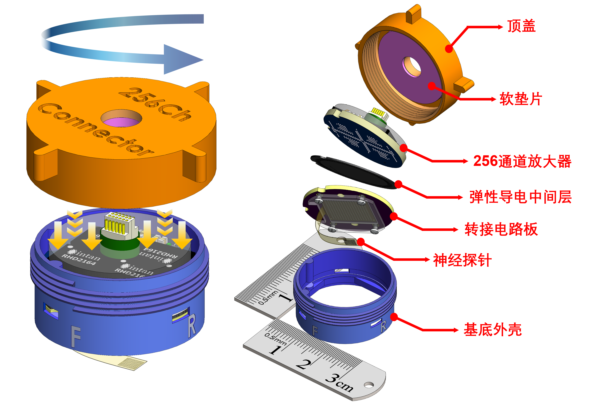
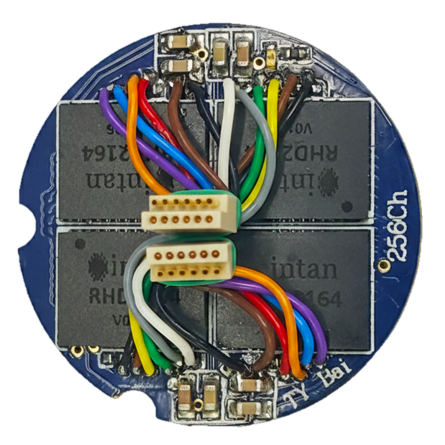

<link rel="preconnect" href="https://fonts.googleapis.com">
<link rel="preconnect" href="https://fonts.gstatic.com" crossorigin>

<link rel="stylesheet" href="{{ '/assets/css/elink-custom.css' | relative_url }}">

  
  
  
  
  
  

  

  <h1 class="header-sync-pulse bi-color-title" style="display: flex; align-items: center; justify-content: center; border-bottom: none; margin-bottom: 5px; font-size: 2.2em; font-weight: 800; letter-spacing: -1px; font-family: 'Inter', 'Noto Sans SC', sans-serif;">
    
    <svg width="45" height="45" viewBox="0 0 24 24" fill="none" xmlns="http://www.w3.org/2000/svg" style="margin-right: 15px;">
      <path d="M10 13a5 5 0 0 0 7.54.54l3-3a5 5 0 0 0-7.07-7.07l-1.72 1.71" stroke="url(#icon-gradient-zh)" stroke-width="2.5" stroke-linecap="round" stroke-linejoin="round"/>
      <path d="M14 11a5 5 0 0 0-7.54-.54l-3 3a5 5 0 0 0 7.07 7.07l1.71-1.71" stroke="url(#icon-gradient-zh)" stroke-width="2.5" stroke-linecap="round" stroke-linejoin="round"/>
      <defs>
        <linearGradient id="icon-gradient-zh" x1="0%" y1="0%" x2="100%" y2="100%">
          <stop offset="0%" stop-color="#60a5fa" />
          <stop offset="50%" stop-color="#a78bfa" />
          <stop offset="100%" stop-color="#f472b6" />
        </linearGradient>
      </defs>
    </svg>

    E-Link(易链256)
  </h1>

<h2 class="sub-title">
  一种基于弹性导电体互连技术的 高密度柔性神经接口连接器
</h2>
  

  

    
    
    
    
     
  

  

   
  
  

    <b>E-Link易链(256) 的插拔动态（左）和结构分解（右）</b>
  

## 🔬 **E-Link ：3D 交互式集成视图**
 


## 🔬 E-Link 三维交互模型



## 🔬 256通道定制放大器 – 三维交互模型



## 📖 概览

**E-Link易链**，是一款基于弹性体互连技术（Elastomer Interconnection）的开源微型基座连接系统。它为柔性神经探针提供了稳固且可扩展的接口，专为自由活动动物的长期实验而优化设计

---

> [!NOTE]
> **核心创新：** 我们打造了一种完全一体化的 “即拧即用” 数据采集方案。该系统利用弹性导电介质连接高密度 PCB，并封装于轻量级基座中。其最大的突破在于实现了“零力插拔”。免去使用者用力插拔的动作，有效规避了高密度引脚连接器常见的断针和弯针风险。

---

### 📊 规格参数

  <table style="margin-left: auto; margin-right: auto; width: 90%; min-width: 600px; text-align: center; border-collapse: collapse; border: 1px solid #e1e4e8;">
    <thead>
      <tr style="background-color: #f6f8fa; border-bottom: 2px solid #e1e4e8;">
        <th style="padding: 10px; border: 1px solid #e1e4e8;">规格项目</th>
        <th style="padding: 10px; border: 1px solid #e1e4e8;">E-Link(256)_V1.0</th>
      </tr>
    </thead>
    <tbody>
      <tr>
        <td style="padding: 8px; border: 1px solid #e1e4e8;"><b>通道数</b></td>
        <td style="padding: 8px; border: 1px solid #e1e4e8;">128 或 256 通道 (支持单/双 SPI 端口)</td>
      </tr>
      <tr>
        <td style="padding: 8px; border: 1px solid #e1e4e8;"><b>总质量</b></td>
        <td style="padding: 8px; border: 1px solid #e1e4e8;">6.6 g (含外壳) 2.8 g (不含外壳)</td>
      </tr>
      <tr>
        <td style="padding: 8px; border: 1px solid #e1e4e8;"><b>互连类型</b></td>
        <td style="padding: 8px; border: 1px solid #e1e4e8;">免焊各向异性弹性体</td>
      </tr>
      <tr>
        <td style="padding: 8px; border: 1px solid #e1e4e8;"><b>兼容采集系统</b></td>
        <td style="padding: 8px; border: 1px solid #e1e4e8;">Intan Recording Controller (512ch/1024ch) Open-Ephys DAQ box NeuroNexus Smartbox OmniPlex DAQ box</td>
      </tr>
      <tr>
        <td style="padding: 8px; border: 1px solid #e1e4e8;"><b>外壳材料</b></td>
        <td style="padding: 8px; border: 1px solid #e1e4e8;">3D 打印 PEEK / 手术级树脂</td>
      </tr>
    </tbody>
  </table>

---

## ✨ 核心特性

  <h3 style="color: #60a5fa; margin-bottom: 20px; font-family: sans-serif;">🌍 跨物种适用性展望 </h3>
  
  

  <svg class="connection-lines" viewBox="0 0 600 380" preserveAspectRatio="none" style="z-index: 1;">
  <path class="base-line" d="M300,141 L135,225" stroke="rgba(255,255,255,0.1)" fill="none" /> 
  <path class="base-line" d="M300,141 L300,255" stroke="rgba(255,255,255,0.1)" fill="none" /> 
  <path class="base-line" d="M300,141 L465,225" stroke="rgba(255,255,255,0.1)" fill="none" /> 
  
  <path class="pulse-line line-to-mouse" d="M300,141 L135,225" />
  <path class="pulse-line" d="M300,141 L300,255" />
  <path class="pulse-line line-to-monkey" d="M300,141 L465,225" />
</svg>

    

      

        <svg width="40" height="40" viewBox="0 0 24 24" fill="none" xmlns="http://www.w3.org/2000/svg">
          <path d="M7 2V4M12 2V4M17 2V4M22 7H20M22 12H20M22 17H20M17 22V20M12 22V20M7 22V20M2 17H4M2 12H4M2 7H4M6 6H18V18H6V6ZM9 9V15H15V9H9Z" stroke="#60a5fa" stroke-width="2" stroke-linecap="round" stroke-linejoin="round"/>
        </svg>
      

      
E-Link (256)

    

    

      
      

        

          🐁
        

        
<i>小鼠</i>

        
顶盖移除后 <b>2.8g 载荷</b>

      

      

        

          🐀
        

        
<i>大鼠</i>

        
长期佩戴 <b>6.6g 共计</b>

      

      

        

          🐒
        

        
<i>灵长类</i>

        
高耐久性 <b>可拓展矩阵</b>

      

    

  

* **⚡ 256 通道高密度接口**
  紧凑的基座占地面积，支持高密度采集，且不增加手术负担。
* **🔌 弹性导电体互连**
  使用各向异性导电弹性体，实现可重复、允许对准误差的一站式电气接触。
* **🐭 专为体内研究优化**
  最小化植入所需面积。核心组件重量仅为 2.8g（移除上盖后），最大限度减少对小鼠自由活动的限制，从而减轻动物负担。
* **🛠️ 模块化与可扩展**
  外壳、PCB 和保护盖均可分离，便于快速迭代和故障排查。
* **🧪 手术级设计**
  纹理化侧壁设计，增强了与牙科水泥或紫外光固化树脂的附着力。

  

---

## 🧩 系统组件

  <table border="1" style="border-collapse: collapse; width: 90%; text-align: center;">
    <thead>
      <tr style="background-color: #f2f2f2;">
        <th>组件</th>
        <th>描述</th>
      </tr>
    </thead>
    <tbody>
      <tr>
        <td><b>基座外壳</b></td>
        <td>3D 打印/机械加工的基座，提供结构支撑和颅骨固定</td>
      </tr>
      <tr>
        <td><b>定制化 256Ch 头部放大器</b></td>
        <td>针对高密度 128/256 通道信号采集优化的记录接口</td>
      </tr>
      <tr>
        <td><b>泡沫垫圈</b></td>
        <td>提供柔性压缩层，确保弹性导电基体上方的电气接触均匀</td>
      </tr>
      <tr>
        <td><b>转接PCB</b></td>
        <td>高密度 4 层 PCB，用于将信号从薄膜探针放大器的球栅阵列图案转换</td>
      </tr>
      <tr>
        <td><b>手术保护盖</b></td>
        <td>保护性外壳，在长期慢性实验中保持电气和机械完整性</td>
      </tr>
    </tbody>
  </table>

---

### 🛠 放大器物料清单 (BOM)

  
  

    <b>已组装的 256 通道前置放大器 (顶视图)</b>
  

  
  

    <b> 顶部4层电路板的设计爆炸动图 </b>
  

      

  <table style="margin-left: auto; margin-right: auto; width: 90%; min-width: 600px; text-align: center; border-collapse: collapse; border: 1px solid #e1e4e8;">
    <thead>
      <tr style="background-color: #f6f8fa; border-bottom: 2px solid #e1e4e8;">
        <th style="padding: 10px; border: 1px solid #e1e4e8; text-align: center;">组件</th>
        <th style="padding: 10px; border: 1px solid #e1e4e8; text-align: center;">描述</th>
        <th style="padding: 10px; border: 1px solid #e1e4e8; text-align: center;">数量</th>
        <th style="padding: 10px; border: 1px solid #e1e4e8; text-align: center;">封装</th>
        <th style="padding: 10px; border: 1px solid #e1e4e8; text-align: center;">备注</th>
      </tr>
    </thead>
    <tbody>
      <tr>
        <td style="padding: 8px; border: 1px solid #e1e4e8; text-align: center;"><b>放大器 IC</b></td>
        <td style="padding: 8px; border: 1px solid #e1e4e8; text-align: center;">Intan RHD2164</td>
        <td style="padding: 8px; border: 1px solid #e1e4e8; text-align: center;">4</td>
        <td style="padding: 8px; border: 1px solid #e1e4e8; text-align: center;">BGA</td>
        <td style="padding: 8px; border: 1px solid #e1e4e8; text-align: center;"><b>关键：</b> 确保方向正确</td>
      </tr>
      <tr>
        <td style="padding: 8px; border: 1px solid #e1e4e8; text-align: center;"><b>SPI 连接器</b></td>
        <td style="padding: 8px; border: 1px solid #e1e4e8; text-align: center;">Omnetics A7621</td>
        <td style="padding: 8px; border: 1px solid #e1e4e8; text-align: center;">2</td>
        <td style="padding: 8px; border: 1px solid #e1e4e8; text-align: center;">-</td>
        <td style="padding: 8px; border: 1px solid #e1e4e8; text-align: center;">12 线线束 (32 AWG)</td>
      </tr>
      <tr>
        <td style="padding: 8px; border: 1px solid #e1e4e8; text-align: center;"><b>电阻</b></td>
        <td style="padding: 8px; border: 1px solid #e1e4e8; text-align: center;">标准贴片</td>
        <td style="padding: 8px; border: 1px solid #e1e4e8; text-align: center;">7</td>
        <td style="padding: 8px; border: 1px solid #e1e4e8; text-align: center;">0402</td>
        <td style="padding: 8px; border: 1px solid #e1e4e8; text-align: center;">LVDS 配置</td>
      </tr>
      <tr>
        <td style="padding: 8px; border: 1px solid #e1e4e8; text-align: center;"><b>电容</b></td>
        <td style="padding: 8px; border: 1px solid #e1e4e8; text-align: center;">标准贴片</td>
        <td style="padding: 8px; border: 1px solid #e1e4e8; text-align: center;">8</td>
        <td style="padding: 8px; border: 1px solid #e1e4e8; text-align: center;">0603</td>
        <td style="padding: 8px; border: 1px solid #e1e4e8; text-align: center;">LVDS 配置</td>
      </tr>
      <tr>
        <td style="padding: 8px; border: 1px solid #e1e4e8; text-align: center;"><b>电源 LED</b></td>
        <td style="padding: 8px; border: 1px solid #e1e4e8; text-align: center;">绿色 LED</td>
        <td style="padding: 8px; border: 1px solid #e1e4e8; text-align: center;">1</td>
        <td style="padding: 8px; border: 1px solid #e1e4e8; text-align: center;">0402</td>
        <td style="padding: 8px; border: 1px solid #e1e4e8; text-align: center;">自检状态灯</td>
      </tr>
      <tr>
        <td style="padding: 8px; border: 1px solid #e1e4e8; text-align: center;"><b> BGA锡球 </b></td>
        <td style="padding: 8px; border: 1px solid #e1e4e8; text-align: center;">0.4 mm 无铅</td>
        <td style="padding: 8px; border: 1px solid #e1e4e8; text-align: center;">约300</td>
        <td style="padding: 8px; border: 1px solid #e1e4e8; text-align: center;">-</td>
        <td style="padding: 8px; border: 1px solid #e1e4e8; text-align: center;">用于 BGA 组装</td>
      </tr>
    </tbody>
  </table>

---

## 👥 开发者与实验室

本项目由达特茅斯学院的 **MINE Lab** 开发。

* **白天宇** (主导研发及设计) 
* **李根**
* **方辉教授** <a href="https://engineering.dartmouth.edu/community/faculty/hui-fang">

---

## 📄 出版物

相关工作目前正在 **IEEE Journal on Flexible Electronics (JFLEX)** 审稿中。

本仓库中的硬件设计和视觉资产直接对应于投稿中描述的系统。

* **完整引用**：正式录用后，最终论文的永久链接将立即在此处更新。
* **预印本/全文**：*即将推出。*
  
* 🤝 **我们诚挚欢迎神经工程科研同行的反馈与合作！**

* **技术咨询**：有意部署 E-Link易链？作为开发者深知从零搭建一套新系统往往伴随诸多挑战。无论您在 PCB 设计、3D 打印制造，还是系统组装方面遇到任何问题，都欢迎随时通过邮件与我们取得联系。将为您提供技术支持！
    * **技术支持**: [support@ephys.tech](mailto:support@ephys.tech)
  
---

## 📑 引用与 DOI

如果您在研究中使用了这些设计、代码或资产，需使用 Zenodo 提供的永久 DOI 引用本仓库：

**当前参考：**
> T. Bai, et al., "E-Link GitHub Repository," v1.0, MINE Lab, Dartmouth College, 2026. 

---

## 🔗 仓库与下载

本项目完全开源。相关论文录用后，包含 **PCB 制造文件 (Gerber)** 和 **3D打印文件** 的完整数据集将通过以下链接提供访问。

  
<b>👇 欢迎收藏本仓库以便未来下载：</b>

  
  

---

## 🤝 致谢

开发者感谢 **美国国立卫生研究院 NIH R01MH139342** 和 **达特茅斯博士生创新奖学金 (Dartmouth PhD Innovation Fellowship)** 的支持。

特别感谢 **达特茅斯Thayer工学院** 的相关成员在易链系统开发过程中提供的技术支持和反馈。

---

## 📜 许可协议

版权所有 © 2026 Tianyu Bai 

本项目为开源硬件，在以下许可下可用。点击下方徽章查看完整许可详情。

* **硬件源文件** (KiCad/Gerbers/STL 文件)：在 **MIT 许可** 下授权。
* **文档、原理图 (PDF) 和图像**：在 **CC BY 4.0 国际许可** 下授权。

  

